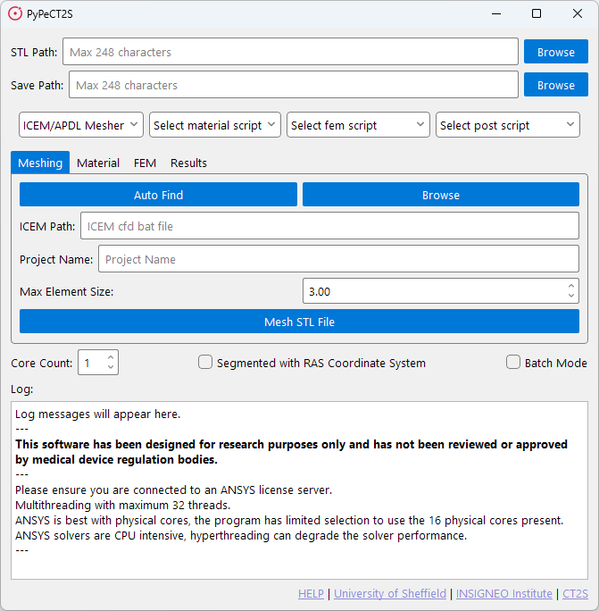
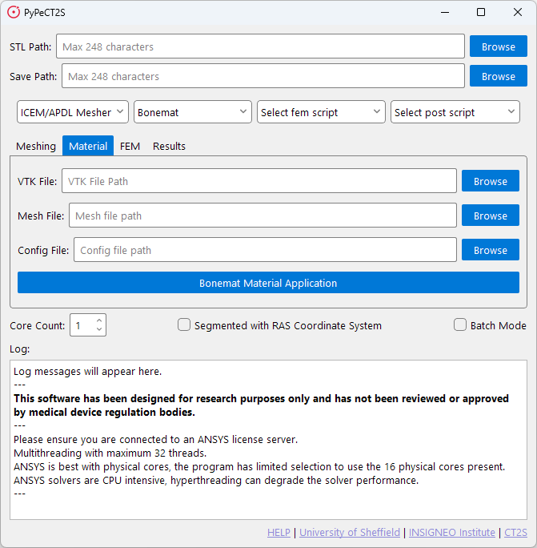
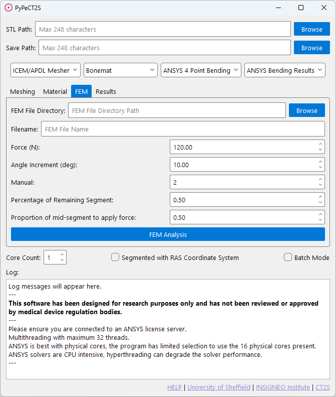
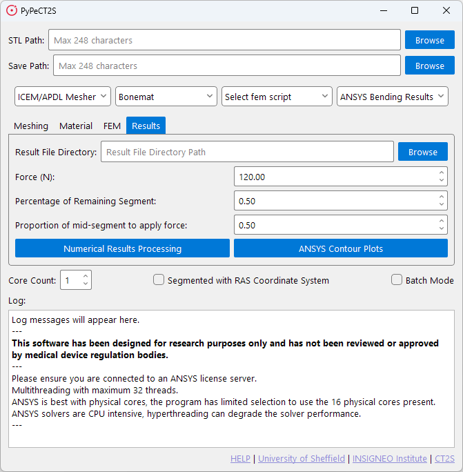

# Usage

## File / Model / Input Requirements

You can start the process at any step by jumping to that tab.

If you wish to start fresh you require the following files:

1. DICOM image scans contained in a `*.VTK` file.
    - Bonemat presents some limitations on the size of VTK files it can process. Please be aware of this.

2. Segmented 3D `*.STL` model of the bone. 
    - _**It is important you check the quality of segmentation, meshing will fail 
    if there are external floating elements in the model.**_
    - The program will provide information about warnings or errors in the model. However, this is not exhaustive and 
    you should check the model yourself.

3. Configuration file for material application, based on the specific CT scanner used.
    - This is a `*.conf` file.
    - If you do not have a configuration file, you can create one using Bonemat.

## Running the Software

The software can be launched by running the `PyPeCT2S.exe` file from release or by running the `PyPeCT2S.py` file 
from source.

Once you have launched the software you can run as many scripts as you like and stop at any point as output files are
saved at each step (e.g. you can run meshing and material application and stop before running the FEM script).

### Main Window

When the software is run, you will be presented with the main window which will look as follows.

<p align="center">
  
</p>

This window present two paths, four drop-down menus, four tabs, a core count selection, two check boxes, a log window,
and a list of links.

#### Required Fields

There are two fields that should be filled in for all included scripts:

- STL Path: The path to the STL file.
- Save Path: The path to save the output files.

These fields are used to process information required for certain functions to run such as rotation of the model,
landmark determination, and key sizing of the entered bone.

#### Drop-down Menus and Tabs

The four drop-down menus are used to select the script you wish to run. 
The four tabs are used to navigate those scripts. The scripts in these dropdowns are populated from the corresponding
libs directories in the program files and are determined on launch.

The tabs and the default included scripts are discussed in detail in the following sections.

- [Meshing Tab](#meshing-tab) section for more information on the Meshing tab.
- [Material Tab](#material-tab) section for more information on the Material tab.
- [FEM Tab](#fem-tab) section for more information on the FEM tab.
- [Results Tab](#results-tab) section for more information on the Results tab.


#### Core Count

The core count selection is used to determine the number of cores to use when running the scripts. 
    
_Important to note:_

- This does not determine the number of cores used by the software itself.
- It is strongly recommended to have at least 4 cores available for the software to run correctly. 
- It is possible you will experience errors if you do not have enough cores.
- Do not assign all the cores on your machine to the scripts, as this will likely cause the software to crash.

#### Checkboxes

There are two checkboxes: 

1. `Segmented with RAS Coordinate System`: This is used to indicate to the software that the model has been segmented 
with the RAS coordinate system. And that it should rotate the model to the LPS coordinate system, so it can have
material properties applied in Bonemat. If you need this on, keep it checked for all steps you run.
    - 3D Slicer exports models in the LPS coordinate system.
    - ITK Snap exports models in the RAS coordinate system.
2. `Batch Mode`: This is used to indicate to the software that you wish to run the scripts in batch mode. This feature
is not currently in the distributed version of the software. Please see the [contact section](index.md#contact) if you
require this feature.

#### Log Window

The log window is used to display information about the scripts as they run. This can be used to check for errors or
warnings that may have occurred during the script run.

#### Links

The links are used to provide information about the software and the authors.

If you require help the HELP link will take you to the documentation.


### Meshing Tab

When selecting the default meshing script, you will be presented with the following window.

<p align="center">
  
</p>

The meshing tab is used to run the meshing script. This script will take the `*.STL` file and create a mesh for running 
FEM simulations. The meshing script will output a `*.cdb` file which can be used in ANSYS. It is recommended to only
use one core for this script as using multiple cores takes longer without much benefit.

Once you are ready to mesh you can press the `Mesh STL File` button. This will start the meshing process and output the
`*.cdb` file to the save path you have selected.

Before the meshing starts the software will check the STL file for any errors. If anything is found it will present a 
list of errors and warnings to you. If the meshing fails you should check these to see what may have caused the issue.

#### ICEM Path

Due to limitations with ICEM CFD, the meshing script requires a path to the ICEM CFD executable. To make this easier
for the user the software will attempt to find the executable for you by checking standard paths when the `Auto Find`
button is clicked. If it cannot find the executable, you will be told, and required to enter the path manually. This
can be done through the `Browse` button.

#### Meshing Options

The meshing parameters for this script are `Project Name` and `Max Element Size`.

1. `Project Name`: This is the name of the file that will be output from ICEM CFD and then APDL.
2. `Max Element Size`: This is the maximum element size for the mesh. This is used to determine the size of the elements.
    - The smaller the element size, the more elements there will be in the mesh.
    - The larger the element size, the fewer elements there will be in the mesh.
    - The element size should be determined based on the size of the bone and the resolution of the scan.

### Material Tab

When selecting the default material script, you will be presented with the following window.

<p align="center">
  
</p>

The material tab is used to run the material application script. This script utilises the command line interface for
Bonemat to apply material properties to the mesh without needing to open the Bonemat GUI.

STL Path is not required for this script, as the script will use the `*.cdb` file output from the meshing script.
However, the Save Path is required to save the output `*.cdb` file.

This script will take three files to apply the material properties to the mesh. 
The files required are the `*.conf` file, the `*.cdb` file, and the `*.VTK` file. The script will output a `*.cdb` file 
with the material properties applied.

This file can then be used in the FEM script to run the simulation.

### FEM Tab

When selecting the default FEM script, you will be presented with the following window.

<p align="center">
  
</p>

The FEM tab is used to run the FEM script. This script will take the `*.cdb` file with material properties and run a 
simulation in ANSYS APDL. The script will output as many `*.db` files as required with the results of the simulation.
Additionally, the script can take previously prepared files saved as `*.db` files and run the simulation on those.

The FEM script utilises automatic landmark determination to determine the orientation of the bone and the location of
the femoral head. This is used to apply the boundary conditions to the bone. If you have landmark files you can
use these instead. The program will not determine landmark points automatically if landmark files are present.

Automatic landmark determination is specific to paediatric femur models, if you do not have a paediatric femur model 
you should determine your landmarks yourself and make sure the files are accessible for the program. This is covered
further in the [Landmark Determination](#landmark-determination) section.

It is recommended to use multiple cores for this script as it can take a long time to run the simulation. 4 cores is 
recommended if you have plenty available. 2 cores is a good reduction in time against 1 core.

Once all parameters have been set you can press the `FEM Analysis` button to start the simulation.

#### Files

The FEM script has two main inputs required:

1. `FEM File Directory`: This is the path to the folder where your `*.cdb` file(s) are stored.
2. `Filename`: This is the name of the file that will be used for the simulation, incase there are multiple files in 
the directory.

#### Parameters

The remaining fields are used to set the parameters that define the boundary conditions. These are:

- `Force`: The force applied to the bone. Measured in Newtons.
- `Angle Increment`: The angle increment for the simulation. This is used to determine the number of steps in 
the simulation. Measured in degrees.
- `Manual`: Specific orientation. 1 - Solves only one specific orientation, 2 - Solves all orientations.
- `Percentage of Remaining Segment`: The percentage of the segment to apply force. Measured in percentage.
- `Proption of mid-segment to apply force`: The proportion of the mid-segment to apply force. Measured in percentage.

### Results Tab

When selecting the default results script, you will be presented with the following window.

<p align="center">
  
</p>

The results tab is used to view the results of the FEM simulation. This script has two different outputs that use
different elements saved from the FEM script.

- `Numerical Results Processing`: This script will take the `*.dat` files output from the FEM script and process them
to provide numerical results and graphs showing failure and maximum 1<sup>st</sup> and 3<sup>rd</sup> principal strains 
against defined failure limits.
- `ANSYS Contour Plots`: This script will take the `*.db` files output from the FEM script and process them to provide
contour plots of the results.

The `Numerical Results Processing` script will output a `*.csv` file with the numerical results and a `*.png` file with
the graphs. The `ANSYS Contour Plots` script will output a `*.png` file with the contour plots.

## Additional Features

Below will be a list of additional features that are included in the software. But are not directly visible to users.

### Landmark Determination

These extra features are used to determine the landmarks of the bone. This is used to determine the orientation of the
bone and the location of the femoral head.

These are specific to paediatric femur models, if you do not have a paediatric femur model you should determine your 
landmarks yourself and make sure the files are accessible for the program.

If landmark files are present the program will not determine landmark points automatically.

Landmark files should be in the same working directory as the `*.cdb` file you are using in a folder called `landmarks`.

Landmark files should be in a plain text format with the following structure:

```
x, y, z
```

or 

```
x
y
z
```

There should be a file for each landmark point. The files should be named as follows:

- `RPOss.txt`: The proximal point of the bone.
- `RDOss.txt`: The distal point of the bone.
- `RMShaft.txt`: The center of mass of the bone.

#### Calculation for the Length of the Bone

Purpose: Calculate the length of the bone by finding the maximum distance between vertices.

Mathematical Operation:

Let $( \mathbf{v}_i )$ be the vertices of the mesh.

Find the farthest vertex $\mathbf{v}_{\text{far}}$ from an arbitrary starting vertex $( \mathbf{v}_0 )$: 

$$
\mathbf{v}_{\text{far}} = \arg\max{\mathbf{v}_i} |\mathbf{v}_0 - \mathbf{v}_i|
$$

Find the maximum distance from $\mathbf{v}_{\text{far}}$: 

$$
\text{max distance} = \max{\mathbf{v}_i} |\mathbf{v}_{\text{far}} - \mathbf{v}_i|
$$

#### Extension of Points Along the Central Long Axis

Purpose: Extend the distal and proximal points along the central axis by a given percentage of the bone length.

Mathematical Operation:

Calculate the central axis vector: 

$$
\mathbf{v}_{\text{axis}} = \mathbf{v}_{\text{distal}} - \mathbf{v}_{\text{proximal}}
$$

Calculate the bone length $L$: 

$$
L = \text{bone length}
$$

Calculate the extension length: 

$$
L_{\text{ext}} = L \times \left(\frac{\text{percentage}}{100}\right)
$$

Normalize the central axis vector: 

$$
\mathbf{d} = \frac{\mathbf{v}_{\text{axis}}}{L}
$$

Extend the distal and proximal points: 

$$
\mathbf{v}_{\text{distal}} = \mathbf{v}_{\text{distal}} + \mathbf{d} \times L_{\text{ext}}
$$ 

$$
\mathbf{v}_{\text{proximal}} = \mathbf{v}_{\text{proximal}} - \mathbf{d} \times L_{\text{ext}}
$$

#### Estimate the Femoral Head Location

Purpose: Estimate the location of the femoral head based on the proximal, distal, and center of mass points.

Mathematical Operation:

Calculate the shaft axis: 

$$
\mathbf{v}_{\text{shaft}} = \mathbf{v}_{\text{proximal}} - \mathbf{v}_{\text{distal}}
$$

Calculate the vector to the center of mass: 

$$
\mathbf{v}_{\text{com}} = \mathbf{v}_{\text{com}} - \mathbf{v}_{\text{proximal}}
$$

Estimate the distance to the femoral head: 

$$
d_{\text{head}} = |\mathbf{v}_{\text{shaft}}| \times \left(\frac{\text{percentage}}{100}\right)
$$

Calculate a perpendicular vector: 

$$
\mathbf{v}_{\perp} = \mathbf{v}_{\text{shaft}} \times \mathbf{v}_{\text{com}}
$$

Calculate the direction to the femoral head: 

$$
\mathbf{v}_{\text{head_dir}} = \mathbf{v}_{\perp} \times \mathbf{v}_{\text{shaft}}
$$

$$
\mathbf{v}_{\text{head_dir_norm}} = \frac{\mathbf{v}_{\text{head_dir}}}{|\mathbf{v}_{\text{head_dir}}|}
$$

Estimate the femoral head location: 

$$
\mathbf{v}_{\text{head}} = \mathbf{v}_{\text{proximal}} - \mathbf{v}_{\text{head_dir_norm}} \times d{_\text{head}}
$$

#### Find the Long Shaft Axis of the Bone

Purpose: Find the long shaft axis of the bone and estimate the femoral head location.

Mathematical Operation:
Calculate the center of mass: 

$$
\mathbf{v}_{\text{com}} = \frac{1}{N} \sum{i=1}^{N} \mathbf{v}_i
$$

Calculate the covariance matrix: 

$$
\mathbf{C} = \frac{1}{N-1} \sum_{i=1}^{N} (\mathbf{v}_i - \mathbf{v}_{\text{com}})(\mathbf{v}_i - \mathbf{v}_{\text{com}})^T
$$

Calculate the principal axes (eigenvectors): 

$$
\mathbf{C} \mathbf{e}_i = \lambda_i \mathbf{e}_i
$$

The shaft axis is the eigenvector with the largest eigenvalue: 

$$
\mathbf{v}_{\text{shaft}} = \mathbf{e}{max}(\lambda)
$$

Project vertices onto the shaft axis: 

$$
\mathbf{p}_i = (\mathbf{v}_i - \mathbf{v}_{\text{com}}) \cdot \mathbf{v}_{\text{shaft}}
$$

Find the proximal and distal points: 

$$
\mathbf{v}_{\text{proximal}} = \mathbf{v}_{min}(\mathbf{p}_i)
$$

$$
\mathbf{v}_{\text{distal}} = \mathbf{v}_{max}(\mathbf{p}_i)
$$

Estimate the femoral head location and extend points along the central axis as described above.


### STL Checks

To try and ensure the quality of the STL file, the software will run a series of checks on the file before running the
meshing script. These checks are not exhaustive, and you should check the file yourself. The checks are as follows:

#### Check Non-manifold edges

_Purpose:_ Checks for edges shared by more than two faces, indicating non-manifold edges.  

_Description:_ This function iterates through all the faces of the STL mesh and counts the occurrences of each edge. 
Edges shared by more than two faces are considered non-manifold.  

#### Check Multiple Bodies

_Purpose:_ Checks for multiple bodies in the STL file by identifying unconnected components.  

_Description:_ This function uses a depth-first search (DFS) algorithm to identify unconnected components in the mesh. 
Each unconnected component is considered a separate body.  

#### check_non_uniform_scaling

_Purpose:_ Checks for non-uniform scaling in the STL mesh.

_Description:_ This function calculates the bounding box of the mesh and checks if the dimensions 
are uniformly scaled. Non-uniform scaling is detected if the dimensions are not proportional.  

#### Check for Faces with Zero Area

_Purpose:_ Checks for degenerate faces (faces with zero area).  

_Description:_ This function iterates through all the faces of the STL mesh and calculates the area of each face. 
Faces with zero area are considered degenerate.  

#### Check for Inverted Normals

_Purpose:_ Checks if normals are consistently oriented.  

_Description:_ This function calculates the center of the mesh and checks if the normals of the faces 
generally point outward. A simple heuristic is used to determine the orientation of the normals.  

#### Check for Holes in the Mesh

_Purpose:_ Checks for holes by ensuring each edge is shared by exactly two faces.  

_Description:_ This function iterates through all the faces of the STL mesh and counts the occurrences of each edge. 
Edges shared by only one face are considered holes.  

#### Check for Duplicate Vertices and Faces

_Purpose:_ Checks for duplicate vertices and faces.

_Description:_ This function identifies and counts duplicate vertices and faces in the STL mesh.